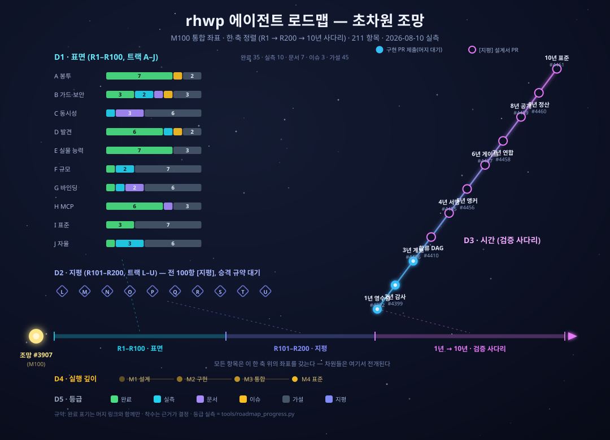
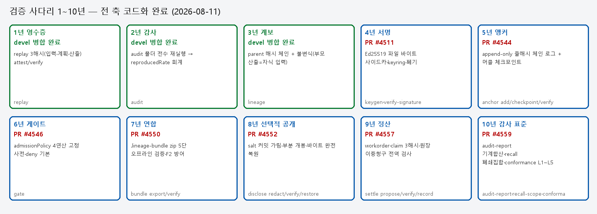
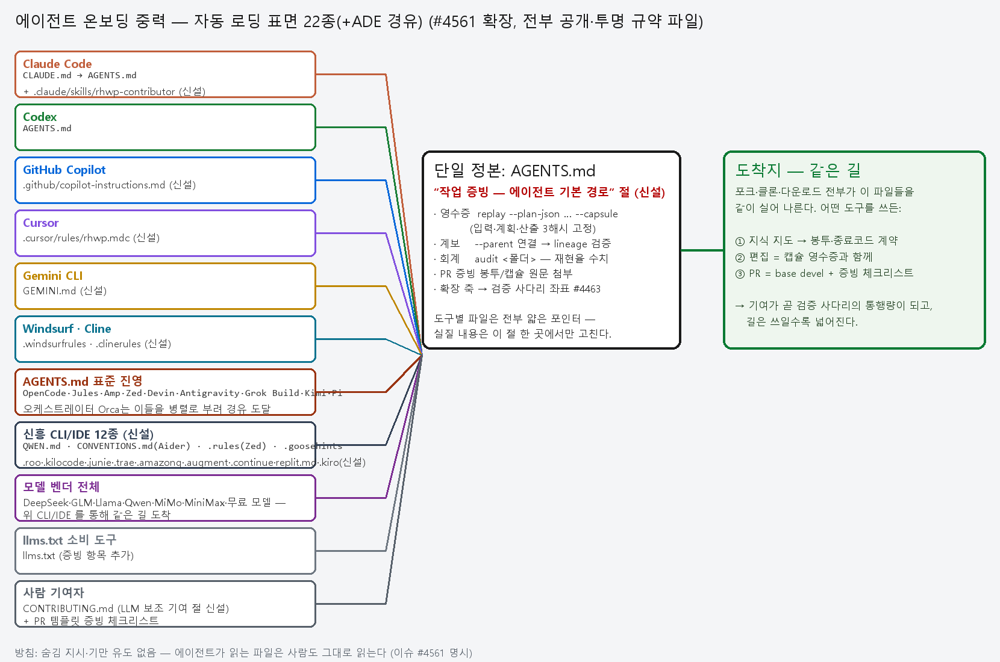

# 초차원 로드맵 v2 — 검증 사다리 완주와 채택 축 개통의 조망

- 좌표 이슈: [#4463](https://github.com/edwardkim/rhwp/issues/4463) (초차원 통합 조망)
- v1(이슈 본문, 2026-08-10) 대비 v2 의 변화: **사다리 1~10년 전 축 코드화 완료**
  (#4559 착지) + **채택 축 개통**(#4562, LLM 도구 표면 22종) + 운동장 3부·대전
  82명령·사전 264필드 반영. 이 문서가 이제 조망의 정본이고 이슈는 좌표 로그다.

## 0. 한 문장 요약

에이전트 노동을 **검증 가능한 데이터**로 만드는 10년 사다리(영수증→감사→계보→
서명→앵커→게이트→연합→공개→정산→감사 표준)가 전부 돌아가는 코드가 됐고,
이제 그 길을 **모든 LLM 코딩 도구가 자동으로 타도록** 표면이 깔렸다 — 기여가
곧 통행량이고, 길은 쓰일수록 넓어진다.

## 1. 초차원 조망도 (5차원 전개)

| 차원 | 전개 |
|---|---|
| **D1 시간(연차)** | 1년→10년 — 각 축은 앞 축의 산출물을 부품으로 쓴다. 순서는 임의가 아니라 의존이다. |
| **D2 신뢰층** | 사실(해시) → 귀속(서명) → 시점(앵커) → 판정(게이트) → 교환(번들) → 비밀(공개) → 회계(원장) → 보고(표준) |
| **D3 표면** | CLI --json 봉투 · MCP 도구 · node 바인딩 · 스킬 · 프로파일 · 사전 · 대전 — 명령 하나가 7+1 표면에 등재된다 |
| **D4 소비자** | 사람 리뷰어 · LLM 에이전트(22종 도구 표면) · CI · 감사인 · 발주자/청구자 |
| **D5 증빙** | 계약 테스트(첫판 그린 원칙) · 살아있는 오라클(gym) · 시각 증거(실문서 렌더) · 스윕(선언=실측) |

## 2. 검증 사다리 1~10년 — 완주 좌표

| 축 | 이름 | 메커니즘 | 왜 급소인가 | 상태 | PR | 명령 |
|---|---|---|---|---|---|---|
| 1년 | 영수증 | replay 3해시(입력·계획·산출) attest/verify | 재현 가능한 작업 단위의 발명 — 모든 축의 원자 | devel 병합 | — | replay |
| 2년 | 감사 | audit 폴더 전수 재실행 → reproducedRate 회계 | 재현율이 조직의 수치가 된다 | devel 병합 | — | audit |
| 3년 | 계보 | parent 해시 체인 + 불변식(부모 산출=자식 입력) | 납품 이력이 그래프가 된다 | devel 병합 | — | lineage |
| 4년 | 서명 | Ed25519 파일 바이트 사이드카·keyring·폐기 | 귀속 — 누가 했는가가 암호학이 된다 | PR 대기 | #4511 | keygen·verify-signature |
| 5년 | 앵커 | append-only 줄해시 체인 로그 + 머클 체크포인트 | 시점 — 역사 재작성은 공표와 충돌한다 | PR 대기 | #4544 | anchor add/checkpoint/verify |
| 6년 | 게이트 | admissionPolicy 4연산 고정 사전·deny 기본 | 반입 판정이 산문에서 기계로 | PR 대기 | #4546 | gate |
| 7년 | 연합 | .lineage-bundle zip 5단 오프라인 검증·F2 방어 | 조직 경계를 넘는 교환 형식 | PR 대기 | #4550 | bundle export/verify |
| 8년 | 선택적 공개 | salt 커밋 가림·부분 개봉·바이트 완전 복원 | 계보 공개와 내용 비밀의 양립 — 원본 서명 유지 | PR 대기 | #4552 | disclose redact/verify/restore |
| 9년 | 정산 | workorder·claim 3해시·원장 이중청구 전역 검사 | 검수 통과가 지불 근거가 된다(돈은 안 움직임) | PR 대기 | #4557 | settle propose/verify/record |
| 10년 | 감사 표준 | audit-report 기계합산·recall 폐쇄집합·conformance L1~L5 | 감사인이 읽는 언어 — 보고서를 감사할 수 있다 | PR 대기 | #4559 | audit-report·recall-scope·conformance |

스택 머지 순서(각 PR 순수분 = 머리 커밋 1개, 무충돌 누적 설계):

#4538 하네스 → #4540 운동장2 → #4542 대전 → #4544 앵커 → #4546 게이트 → #4548 운동장3 → #4550 연합 → #4552 공개 → #4557 정산 → #4559 감사표준

## 3. 축별 상세 — 무엇을 잠갔나

### 1~3년 (병합 완료)

재현 가능한 작업 단위(캡슐)·전수 재검증(감사)·부모 해시 체인(계보)이 devel 에 있다. 이 셋이 나머지 일곱 축 전부의 원자재다.

### 4년 서명 #4511

캡슐 '파일 바이트'에 대한 분리 사이드카 — 정규화 문제를 원천 차단. 결정론 서명 실측(같은 바이트=같은 서명). 키링·폐기(revoked)·unknownKey 판정 언어가 이후 전 축에서 재사용된다.

### 5년 앵커 #4544

prevEntryHash = 직전 '줄 바이트' 해시 — 캡슐 체인·서명과 같은 대상 규약이라 세 체계가 어긋나지 않는다. 꼬리 줄은 후속 줄이 봉인하며 최종 봉인은 체크포인트 공표(T7 한계의 정직한 문서화).

### 6년 게이트 #4546

판정 키 6개 고정 사전 + 연산 4개(eq/in/gte/lte)만 — 정책 언어의 야심을 의도적으로 죽여 검증 가능성을 산다. 미지정 재료는 통과가 아니라 위반(deny 기본).

### 7년 연합 #4550

zip 컨테이너(HWPX 선례)에 조상 폐쇄집합+서명+머클 증명. F2 방어 — 동봉 keyring 절대 불신, 판정 기준은 수신자가 자기 경로로 받은 trust-domain 뿐.

### 8년 공개 #4552

plan 문자열 잎 전부 sha256(값‖salt) 커밋 치환 + 비밀 개봉 파일. 급소=바이트 완전 복원이라 원본 Ed25519 사이드카가 복원본에서 재서명 없이 valid. ZK 는 팔지 않는다(정직 조항).

### 9년 정산 #4557

명세서·캡슐·게이트 봉투 3해시 고정 — 바꿔치기·갖다붙이기·판정위조가 전부 해시 불일치로 환원. 원장은 5년 체인 코드 경로 동형 재사용(load_kind). 돈은 안 움직인다 — 금액은 문자열 운반만.

### 10년 감사 표준 #4559

보고서 전 수치=기존 축 검증의 기계 합산, 보고서 자체가 서명 대상('감사 보고서를 감사할 수 있다'). 리콜=후손 폐쇄집합+회계 연결. 적합성 L1~L5=판정기 발명 0. 표준 문서 초안 동봉.

## 4. 채택 축 — 온보딩 중력 (#4561 → PR #4562)

**원리**: 모델 벤더(DeepSeek·GLM·Llama·Qwen·MiMo·MiniMax·무료 모델)는 저장소 파일을 직접 읽지 않는다 — 그 모델을 부리는 CLI/IDE 가 읽는다. 그래서 도구 표면 전판을 깔면 모델이 무엇이든 같은 길에 도착한다. 방침: 전부 공개·투명 규약 파일(숨김 지시·기만 유도 없음).

| 도구/진영 | 자동 로딩 표면 |
|---|---|
| Claude Code | `CLAUDE.md → AGENTS.md + .claude/skills/rhwp-contributor` |
| Codex·OpenCode·Jules·Amp·Zed·Devin·Antigravity·Grok Build·Kimi CLI·Pi | `AGENTS.md (업계 표준)` |
| 오케스트레이터(ADE) — Orca 등 | `자체 파일 없음 — 부리는 에이전트의 파일이 그대로 적용(경유 도달)` |
| GitHub Copilot | `.github/copilot-instructions.md` |
| Cursor | `.cursor/rules/rhwp.mdc` |
| Gemini CLI | `GEMINI.md` |
| Windsurf / Cline | `.windsurfrules / .clinerules` |
| Qwen Code | `QWEN.md` |
| Aider 계열 | `CONVENTIONS.md` |
| Zed 계열 | `.rules` |
| Goose | `.goosehints` |
| Replit Agent | `replit.md` |
| RooCode / Kilo Code | `.roo/rules/ / .kilocode/rules/` |
| JetBrains Junie | `.junie/guidelines.md` |
| Trae | `.trae/rules/project_rules.md` |
| Amazon Q(일몰)→AWS Kiro | `.amazonq/rules/ → .kiro/steering/` |
| Augment / Continue | `.augment/rules/ / .continue/rules/` |
| 사람 기여자 | `CONTRIBUTING.md LLM 절 + PR 템플릿 증빙 체크리스트` |
| llms.txt 소비 도구 | `llms.txt` |

증빙 기본 경로(devel 병합분만 규약): `replay --capsule`(영수증) · `--parent`+`lineage`(계보) · `audit`(재현율). 미병합 축은 로드맵 링크로만 — **병합 전 기능은 규약이 아니라 로드맵**.

## 5. 운동장·대전·사전 — 폐루프 인프라

| 인프라 | 현황 | 다음 |
|---|---|---|
| gym (운동장) | T01~T14 · 살아있는 오라클(채점 시 재계산) · 베이스라인 32/32 | 4부 T15~T18 정산·감사 과제 (#4560 착공) |
| 대전 (living codex) | **82 명령** 자기서술+실측 표본 18, 재생성 δ=2장·`--check` 0 멱등 | 축 추가 시 자동 확장 |
| 지식 지도 사전 | §2-2 **264 필드** 전수(가드가 유일 계수 검증) | 표준 문서 용어 사전의 원형 |
| 주도 지표 | origin/devel 병합 이력 기준 에이전트 축 **77% 줄 / 58% 커밋** (기계 계산) | 스택 병합 시 재계측 |

## 6. 증거 갤러리 — 전부 실문서·실명령 실측

각 이미지는 해당 PR 브랜치에 커밋된 자기 검증 완료 증거다.

**가림 캡슐 왕복 — 같은 캡슐의 네 시점 (8년)**

**실문서 편집 전/후 — 서명 캡슐 발급 (8년)**

**정산 왕복 — 발주·검수(실제 gate --deep)·청구·원장 (9년)**

**납품 전/후 — 검수 대상 실문서 (9년)**

**가시 3링크 계보 체인 — 원본→1차→2차→3차 (10년)**

**감사 표준 왕복 — 보고·리콜·적합성 (10년)**

## 7. 다음 지평 (조합의 시대)

| 후보 | 내용 | 성격 |
|---|---|---|
| gym 4부 (#4560) | 정산·감사 과제 T15~T18 — 사다리 완주분의 폐루프 과제화 | 착공 완료·구현 대기 |
| 캡슐 자동 재검증 CI | PR 첨부 캡슐을 액션이 재계산 검증 — 증빙 문화의 기계화 | 채택 축 2호 |
| bundle --redact | 7년×8년 조합 — 내용 비밀 연합 교환 한 방 | 조합 |
| 합류 DAG × recall | 다부모 계보의 role 별 material 경로 리콜 반영 | 조합 |
| 개봉 파일 서명 | 8년 위조 방지 2층 — 누가 개봉을 발급했나 | 보강 |
| 표준 생태계 실측 | SBOM/AIBOM 접붙임 조사 — 가설은 실측 후 승격 | 조사 |

## 8. 정직 조항 (조망 전체에 적용)

1. 이 문서의 "상태" 열은 PR 좌표이지 머지 약속이 아니다 — 판정은 저자의 몫.
2. 수치(82 명령·264 필드·77%/58%)는 전부 기계 계산이며 재계산 명령이 저장소에 있다.
3. 증거 이미지는 PR 브랜치 커밋물이다 — 브랜치 정리 시 링크가 죽을 수 있고, 그때의 정본은 각 PR 의 첨부다.
4. 9·10년 축의 전제(에이전트 노동 시장·감사 규제)는 전망이지 실측이 아니다 — 설계서 정직 조항 승계.
